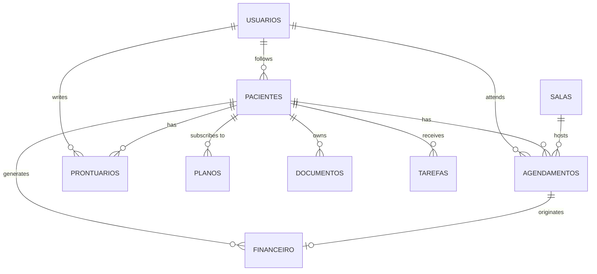

# PsicoGest

Web application for managing psychology clinics: patients, session scheduling, clinical records, finances and reports, with JWT authentication and role-based access control.


> The user interface is in Brazilian Portuguese, and database tables, columns and API routes keep their Portuguese names (e.g. `pacientes` = patients, `agendamentos` = appointments, `prontuarios` = clinical records).

---

## Features

| Module | What it does |
|---|---|
| **Authentication** | Sign-up and login with bcrypt-hashed passwords and a JWT valid for 8 hours |
| **Dashboard** | Totals for patients and sessions, revenue, expenses and profit, plus a monthly bar chart |
| **Patients** | Create, list and delete patients; shortcut to each patient's clinical record |
| **Schedule** | Monthly calendar of sessions, with patient and room selection and session cancellation |
| **Clinical records** | Intake (anamnesis) and progress notes, with *draft* or *finalized* status |
| **Finances** | Income and expense entries with payment method and status |
| **Reports** | Consolidated indicators and a monthly income × expenses line chart |

### Roles

There are three roles: `admin`, `psicologo` (psychologist) and `paciente` (patient). Every API route requires a token, and some also require a specific role:

| Resource | admin | psicologo | paciente |
|---|:---:|:---:|:---:|
| Patients, schedule, plans, documents, tasks, rooms, reports | ✅ | ✅ | ✅ |
| Clinical records | ✅ | ✅ | ❌ |
| Finances and health insurance plans | ✅ | ❌ | ❌ |

---

## Tech stack

**Back end:** Node.js, Express 5, Supabase (PostgreSQL), JSON Web Token, bcryptjs, dotenv, CORS
**Front end:** HTML, CSS and vanilla JavaScript, Chart.js
**Tooling:** nodemon

---

## Architecture

```
PsicoGest/
├── backend/
│   ├── config/
│   │   └── supabase.js          # Supabase client
│   ├── middleware/
│   │   └── authMiddleware.js    # JWT validation and role check
│   ├── routes/
│   │   ├── authRoutes.js        # /api/auth (register, login)
│   │   ├── crudFactory.js       # Generates CRUD routes for any table
│   │   └── relatoriosRoutes.js  # /api/relatorios (dashboard, monthly finances)
│   └── server.js                # Entry point; serves the API and the front end
├── database/
│   └── schema.sql               # PostgreSQL table definitions
├── frontend/
│   ├── css/style.css
│   ├── js/                      # One script per page + api.js (requests and sidebar)
│   └── pages/                   # login, dashboard, agenda, pacientes, prontuario, financeiro, relatorios
├── .env.example
└── package.json
```

### CRUD route factory

Instead of writing one route file per table, `crudFactory(table)` generates the five standard operations for any table in the database:

```js
app.use('/api/pacientes',   authMiddleware, crudFactory('pacientes'));
app.use('/api/prontuarios', authMiddleware, permitir('admin', 'psicologo'), crudFactory('prontuarios'));
app.use('/api/financeiro',  authMiddleware, permitir('admin'), crudFactory('financeiro'));
```

Authorization comes from composing middlewares: `authMiddleware` validates the token, and `permitir(...roles)` allows or blocks each role.

---

## Data model



There is also a `convenios` table that stores how the session fee is split between the health insurance plan and the patient. The full script is in [`database/schema.sql`](database/schema.sql).

---

## Getting started

### Prerequisites

- [Node.js](https://nodejs.org/) 18 or later
- A [Supabase](https://supabase.com/) account and project

### 1. Clone and install

```bash
git clone https://github.com/guilhermefontesdev/PsicoGest.git
cd PsicoGest
npm install
```

### 2. Create the database

In the Supabase dashboard, open **SQL Editor**, paste the contents of `database/schema.sql` and run it. The script creates the tables and two initial rooms.

### 3. Set the environment variables

Copy the example file and fill it in with your project's details (**Project Settings → API** in Supabase):

```bash
cp .env.example .env
```

```env
PORT=4234
SUPABASE_URL=https://your-project.supabase.co
SUPABASE_ANON_KEY=your-supabase-key
JWT_SECRET=a-long-random-passphrase
```

> The `.env` file holds secrets and must not be pushed to GitHub. It is already listed in `.gitignore`.

### 4. Run

```bash
npm run dev     # with auto-reload (nodemon)
# or
npm start
```

Open **http://localhost:4234**. You will be redirected to the login page, where you can create the first user in the **Cadastrar** (Sign up) tab.

---

## API

Every route except `/api/auth` requires the `Authorization: Bearer <token>` header.

### Authentication

| Method | Route | Body |
|---|---|---|
| `POST` | `/api/auth/register` | `{ nome, email, senha, perfil }` (name, email, password, role) |
| `POST` | `/api/auth/login` | `{ email, senha }` → returns `{ token, usuario }` |

### Resources (CRUD)

Available for `pacientes`, `agendamentos`, `prontuarios`, `financeiro`, `planos`, `documentos`, `convenios`, `tarefas` and `salas`:

| Method | Route | Action |
|---|---|---|
| `GET` | `/api/{resource}` | List records |
| `GET` | `/api/{resource}/:id` | Get one record |
| `POST` | `/api/{resource}` | Create a record |
| `PUT` | `/api/{resource}/:id` | Update a record |
| `DELETE` | `/api/{resource}/:id` | Delete a record |

### Reports

| Method | Route | Returns |
|---|---|---|
| `GET` | `/api/relatorios/dashboard` | `{ pacientes, sessoes, receita, despesa, lucro, prontuarios }` (patients, sessions, revenue, expenses, profit, records) |
| `GET` | `/api/relatorios/financeiro-mensal` | Revenue and expenses for each of the 12 months |

---

## Roadmap

- [ ] Screens for plans, documents (file upload), health insurance plans and tasks, which already have API routes
- [ ] Filter patients, schedule and clinical records by the logged-in psychologist
- [ ] Edit patients and clinical records from the UI
- [ ] Validate incoming data before writing to the database
- [ ] Enable Row Level Security in Supabase and use the service key on the server only
- [ ] Automated API tests

---

## Author

**Guilherme Viana Fontes**
Software Engineering student at UCSal · Aspiring back-end developer

[](https://github.com/guilhermefontesdev)
