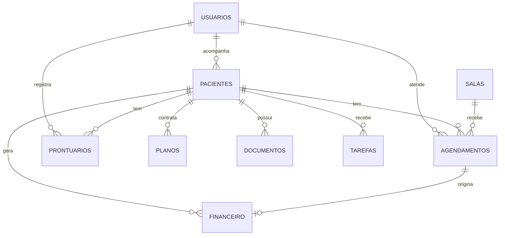

# Ψ PsicoGest

Sistema web para gestão de clínicas de psicologia: pacientes, agenda de sessões, prontuários, controle financeiro e relatórios, com autenticação por JWT e controle de acesso por perfil.


---

## Funcionalidades

| Módulo | O que faz |
|---|---|
| **Autenticação** | Cadastro e login com senha criptografada (bcrypt) e token JWT válido por 8 horas |
| **Dashboard** | Totais de pacientes e sessões, receita, despesa e lucro, com gráfico mensal de barras |
| **Pacientes** | Cadastro, listagem e exclusão; atalho direto para o prontuário do paciente |
| **Agenda** | Calendário do mês com as sessões, escolha de paciente e sala, cancelamento de sessão |
| **Prontuários** | Registro de anamnese e evolução, com status *rascunho* ou *finalizado* |
| **Financeiro** | Lançamento de receitas e despesas com forma e status de pagamento |
| **Relatórios** | Indicadores consolidados e gráfico de linha de receitas × despesas por mês |

### Perfis de acesso

O sistema tem três perfis: `admin`, `psicologo` e `paciente`. Todas as rotas da API exigem token, e algumas exigem perfil específico:

| Recurso | admin | psicologo | paciente |
|---|:---:|:---:|:---:|
| Pacientes, agenda, planos, documentos, tarefas, salas, relatórios | ✅ | ✅ | ✅ |
| Prontuários | ✅ | ✅ | ❌ |
| Financeiro e convênios | ✅ | ❌ | ❌ |

---

## Tecnologias

**Back-end:** Node.js, Express 5, Supabase (PostgreSQL), JSON Web Token, bcryptjs, dotenv, CORS
**Front-end:** HTML, CSS e JavaScript puro, Chart.js
**Ferramentas:** nodemon

---

## Arquitetura

```
psicogest/
├── backend/
│   ├── config/
│   │   └── supabase.js          # Cliente do Supabase
│   ├── middleware/
│   │   └── authMiddleware.js    # Validação do JWT e checagem de perfil
│   ├── routes/
│   │   ├── authRoutes.js        # /api/auth (register, login)
│   │   ├── crudFactory.js       # Gera as rotas CRUD de qualquer tabela
│   │   └── relatoriosRoutes.js  # /api/relatorios (dashboard, financeiro mensal)
│   └── server.js                # Ponto de entrada; serve a API e o front-end
├── database/
│   └── schema.sql               # Criação das tabelas no PostgreSQL
├── frontend/
│   ├── css/style.css
│   ├── js/                      # Um script por página + api.js (requisições e sidebar)
│   └── pages/                   # login, dashboard, agenda, pacientes, prontuario, financeiro, relatorios
├── .env.example
└── package.json
```

### Fábrica de rotas CRUD

Em vez de escrever um arquivo de rotas por tabela, o `crudFactory(tabela)` gera as cinco operações padrão para qualquer tabela do banco:

```js
app.use('/api/pacientes',   authMiddleware, crudFactory('pacientes'));
app.use('/api/prontuarios', authMiddleware, permitir('admin', 'psicologo'), crudFactory('prontuarios'));
app.use('/api/financeiro',  authMiddleware, permitir('admin'), crudFactory('financeiro'));
```

A autorização fica na composição de middlewares: `authMiddleware` valida o token e `permitir(...perfis)` libera ou bloqueia o perfil.

---

## Modelo de dados



Também há a tabela `convenios`, que guarda a divisão percentual entre convênio e paciente. O script completo está em [`database/schema.sql`](database/schema.sql).

---

## Como executar

### Pré-requisitos

- [Node.js](https://nodejs.org/) 18 ou superior
- Uma conta e um projeto no [Supabase](https://supabase.com/)

### 1. Clonar e instalar

```bash
git clone https://github.com/guilhermefontesdev/psicogest.git
cd psicogest
npm install
```

### 2. Criar o banco

No painel do Supabase, abra **SQL Editor**, cole o conteúdo de `database/schema.sql` e execute. O script cria as tabelas e duas salas iniciais.

### 3. Configurar as variáveis de ambiente

Copie o arquivo de exemplo e preencha com os dados do seu projeto (**Project Settings → API** no Supabase):

```bash
cp .env.example .env
```

```env
PORT=4234
SUPABASE_URL=https://seu-projeto.supabase.co
SUPABASE_ANON_KEY=sua-chave-do-supabase
JWT_SECRET=uma-frase-longa-e-aleatoria
```

> O arquivo `.env` contém segredos e não deve ser enviado ao GitHub. Ele já está no `.gitignore`.

### 4. Rodar

```bash
npm run dev     # com recarregamento automático (nodemon)
# ou
npm start
```

Acesse **http://localhost:4234**. Você será redirecionado para a tela de login, onde pode criar o primeiro usuário na aba **Cadastrar**.

---

## API

Todas as rotas, exceto `/api/auth`, exigem o cabeçalho `Authorization: Bearer <token>`.

### Autenticação

| Método | Rota | Corpo |
|---|---|---|
| `POST` | `/api/auth/register` | `{ nome, email, senha, perfil }` |
| `POST` | `/api/auth/login` | `{ email, senha }` → retorna `{ token, usuario }` |

### Recursos (CRUD)

Disponíveis para `pacientes`, `agendamentos`, `prontuarios`, `financeiro`, `planos`, `documentos`, `convenios`, `tarefas` e `salas`:

| Método | Rota | Ação |
|---|---|---|
| `GET` | `/api/{recurso}` | Lista os registros |
| `GET` | `/api/{recurso}/:id` | Busca um registro |
| `POST` | `/api/{recurso}` | Cria um registro |
| `PUT` | `/api/{recurso}/:id` | Atualiza um registro |
| `DELETE` | `/api/{recurso}/:id` | Remove um registro |

### Relatórios

| Método | Rota | Retorno |
|---|---|---|
| `GET` | `/api/relatorios/dashboard` | `{ pacientes, sessoes, receita, despesa, lucro, prontuarios }` |
| `GET` | `/api/relatorios/financeiro-mensal` | Receita e despesa de cada um dos 12 meses |

---

## Próximos passos

- [ ] Telas para planos, documentos (upload de arquivos), convênios e tarefas, que já têm rotas na API
- [ ] Filtrar pacientes, agenda e prontuários pelo psicólogo logado
- [ ] Edição de pacientes e prontuários pela interface
- [ ] Validação dos dados recebidos antes de gravar no banco
- [ ] Ativar Row Level Security no Supabase e usar a chave de serviço apenas no servidor
- [ ] Testes automatizados da API

---

## Autor

**Guilherme Viana Fontes**
Estudante de Engenharia de Software na UCSal · Desenvolvedor back-end em formação

[](https://github.com/guilhermefontesdev)
